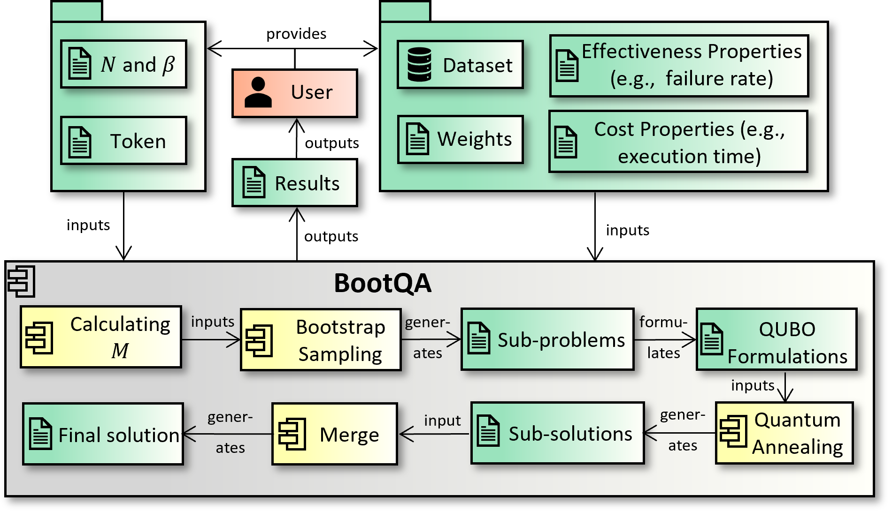

# BQTmizer: A Tool for Test Case Minimization with Quantum Annealing

## Introduction
BQTmizer is a tool based on [BootQA](http://dx.doi.org/10.1145/3680467). It leverages quantum annealing (QA) to tackle large-scale real-world test case minimization (TCM) problems, which aims to select the smallest test suite while satisfying all testing objectives. It is a classical-quantum hybrid tool that integrates
classical bootstrap sampling to optimize the use of limited number of available  qubits in the current QA hardware. 

## Overview


## How to run
BQTmizer is running on the local host.
Please first download the repository and create the environment.
Anaconda Python distribution is required [here](https://www.anaconda.com/products/distribution)
```
git clone https://github.com/qiqihannah/BQTmizer.git
cd bqtmizer
conda create -n bqtmizer_env python=3.10
conda activate bqtmizer_env
pip install -r requirements.txt
```
Now, run the following code to start BQTmizer.
```
streamlit run bqtmizer_st.py
```

More details can be found in this video [here](https://youtu.be/i0ZNHLr1XDw.).

